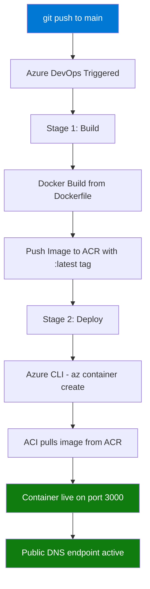

# 🚀 Azure DevOps CI/CD Pipeline — Docker to ACI


> A containerized **Node.js** web application deployed via a fully automated **Azure DevOps CI/CD pipeline** — from a `git push` to a live container on **Azure Container Instances (ACI)** in a single workflow.

---

## 📋 Table of Contents

- [Overview](#-overview)
- [Architecture](#-architecture)
- [Pipeline Flow](#-pipeline-flow)
- [Tech Stack](#️-tech-stack)
- [Project Structure](#-project-structure)
- [Getting Started](#-getting-started)
- [Running Locally](#️-running-locally)
- [Accessing the Deployed App](#-accessing-the-deployed-app)
- [What I Learned](#-what-i-learned)
- [Author](#-author)

---

## 🌟 Overview

This project demonstrates a production-style DevOps workflow using Azure's native tooling. A push to the `main` branch automatically:

1. **Builds** a Docker image from the Node.js app
2. **Pushes** the image to a private Azure Container Registry (ACR)
3. **Deploys** the image as a running container on Azure Container Instances (ACI) with a public DNS endpoint

No manual steps. No clicking through the Azure portal. Just `git push`.

---

## 🏗️ Architecture

```
┌─────────────────────────────────────────────────────────────┐
│                        Developer Machine                    │
│                        git push origin main                 │
└──────────────────────────────┬──────────────────────────────┘
                               │ webhook trigger
                               ▼
┌─────────────────────────────────────────────────────────────┐
│                     Azure DevOps Pipeline                   │
│                                                             │
│   ┌─────────────────────┐      ┌─────────────────────────┐  │
│   │   Stage 1: BUILD    │────▶│   Stage 2: DEPLOY        │ │
│   │                     │      │                         │  │
│   │  • docker build     │      │  • az container create  │  │
│   │  • docker push      │      │  • pulls from ACR       │  │
│   │    → ACR            │     │    → deploys to ACI      │ │
│   └─────────────────────┘      └─────────────────────────┘  │
└─────────────────────────────────────────────────────────────┘
          │                                    │
                 ▼                                                             ▼
┌──────────────────┐               ┌──────────────────────┐
│  Azure Container │               │  Azure Container     │
│  Registry (ACR)  │               │  Instances (ACI)     │
│  private image   │               │  port 3000 — public  │
│  registry        │               │  DNS endpoint        │
└──────────────────┘               └──────────────────────┘
```

---

## 🔄 Pipeline Flow



---

## 🛠️ Tech Stack

| Technology | Version | Purpose |
|---|---|---|
| Node.js | 18 LTS | Web application runtime |
| Express | 4.x | HTTP server framework |
| Docker | Alpine base | Container image |
| Azure Container Registry | — | Private Docker image registry |
| Azure Container Instances | — | Serverless container hosting |
| Azure DevOps Pipelines | — | CI/CD automation |
| Azure CLI | — | Infrastructure scripting |

---

## 📁 Project Structure

```
azure-devops-aci-pipeline/
├── app.js                  # Express web server (serves the UI on port 3000)
├── package.json            # Node.js dependencies and project metadata
├── Dockerfile              # Container image definition (Alpine base)
└── azure-pipelines.yml     # Two-stage CI/CD pipeline (Build → Deploy)
```

---

## 🚀 Getting Started

### Prerequisites

- Active **Azure subscription**
- **Azure DevOps** organization ([dev.azure.com](https://dev.azure.com))
- **Azure CLI** installed locally (`az --version`)
- **Docker** installed locally

### Step 1 — Provision Azure Resources

```bash
# Login to Azure
az login

# Create resource group
az group create --name devops-rg --location eastus

# Create Azure Container Registry with admin access enabled
az acr create \
  --resource-group devops-rg \
  --name devopsacrdemo123 \
  --sku Basic \
  --admin-enabled true
```

### Step 2 — Configure Azure DevOps Service Connections

In Azure DevOps → **Project Settings** → **Service Connections**, create two connections:

| Name | Type | Points To |
|---|---|---|
| `ACR-Service-Connection` | Docker Registry | Your Azure Container Registry |
| `Azure-Service-Connection` | Azure Resource Manager | Your Azure subscription |

### Step 3 — Connect the Pipeline

1. Go to **Azure DevOps** → **Pipelines** → **New Pipeline**
2. Select your repository
3. Choose **Existing Azure Pipelines YAML file**
4. Select `azure-pipelines.yml`
5. Save and run

### Step 4 — Trigger a Deployment

```bash
git push origin main
```

That's it — the pipeline will build, push, and deploy automatically.

---

## 🖥️ Running Locally

```bash
# Clone the repository
git clone https://github.com/Nev-007/azure-devops-aci-pipeline.git
cd azure-devops-aci-pipeline

# Install dependencies
npm install

# Start the server
node app.js

# Visit http://localhost:3000
```

**Or with Docker:**

```bash
# Build the image
docker build -t devops-aci-demo .

# Run the container
docker run -p 3000:3000 devops-aci-demo

# Visit http://localhost:3000
```

---

## 🌐 Accessing the Deployed App

Once the pipeline completes, the app is accessible at:

```
http://devops-aci-demo123.<region>.azurecontainer.io:3000
```

You can also check the container status via Azure CLI:

```bash
az container show \
  --resource-group devops-rg \
  --name devops-aci-container \
  --query "{Status:instanceView.state, IP:ipAddress.ip, FQDN:ipAddress.fqdn}" \
  --output table
```

---

## 📖 What I Learned

- **Multi-stage Azure DevOps pipelines** — separating Build and Deploy concerns into independent stages with proper dependency handling
- **Docker image lifecycle** — building optimized Alpine-based images and managing them in a private Azure Container Registry
- **Azure Container Instances** — provisioning serverless containers via Azure CLI without managing VMs or Kubernetes clusters
- **Service connections & secrets** — securely connecting Azure DevOps to ACR and Azure subscriptions without hardcoding credentials
- **Infrastructure as Code mindset** — defining the entire deployment process in a single YAML file that lives alongside the application code

---

> Built with ❤️ by [Nev](https://github.com/Nev-007)
